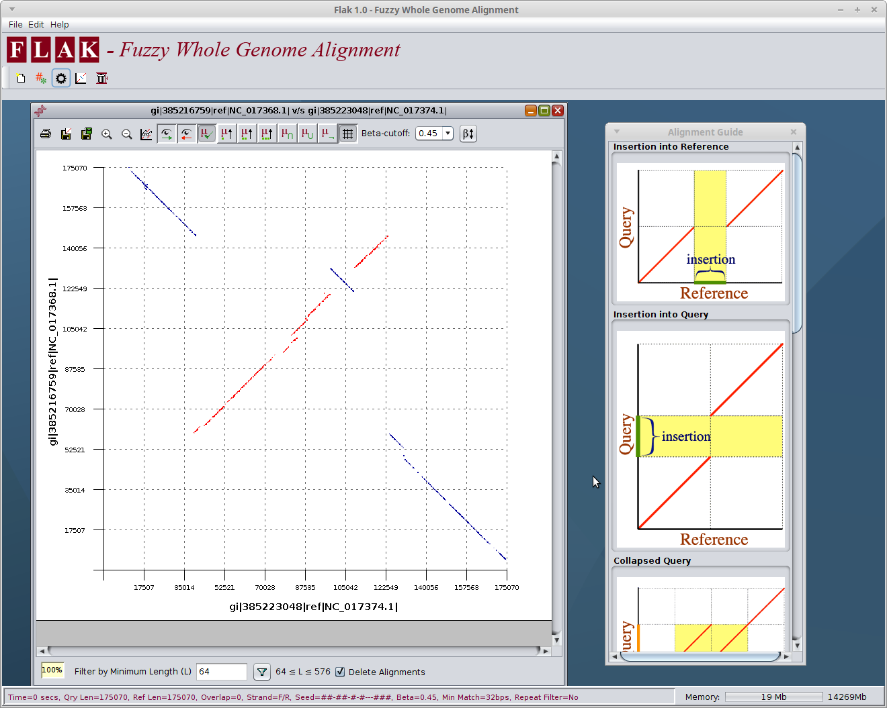

<table bgcolor="#FFFFFF" width="100%" cellspacing="0" cellpadding="5" border="0">
		<tr>
			<td bgcolor="#6699cc">
				
			</td>
		</tr>

		<tr>
			<td valign="top">

<h1>Overview</h1>
FLAK (<b>Fuzzy Logic Analysis of <i>k</i>-mers</b>) is a software system designed to perform a fast approximate whole-genome comparison of two DNA sequences and enable
fuzzy operations to be performed on a finished alignment in a visual and intuitive way. In contrast with existing genome alignment systems that are based
on exact-matching suffix tree data structures or provide approximations using the BLAST-like <i>seed-and-extend</i> model, FLAK has a built-in native mechanism for
approximate sequence matching. The kernel of the FLAK system is an optimised fuzzy hash map that enables a genome to be searched in average <i>O</i>(1)
running time. FLAK is written in Java and uses a 2-bit encoding mechanism to represent and compress each 32-mer substring of a genome into a single 64-bit
(8 byte) primitive type. The representation of DNA sequence information as a bit vector greatly reduces the space complexity of the system and enables
FLAK to scale from small prokaryotic genomes (&lt;5Mbps) to large mammalian chromosomes or genomes (&gt;3 Gbps). Moreover, the exploitation of bit vectors
using low-level binary shift operations further reduces the time complexity of genome alignment.

&nbsp;

&nbsp;

<h2>Why Use FLAK?</h2>
Because FLAK asks a different kind of question. FLAK alignments are based on fuzzy logic and fuzzy sets and can accommodate vagueness. In the context of biological sequence alignment, the vagueness in question relates to
the degree of homology between two sequences. As FLAK is designed around fuzzy sets and fuzzy logic, the alignment system is fundamentally different to
all existing genome aligners and deals with degrees of fuzzy set membership and degrees of homology. All existing whole-genome aligners are based on bivalent
boolean logic and, at an abstract level, ask the question <i>"Are the sequences homologous?"</i>. In contrast, the fuzzy nature of FLAK is designed to answer the
question <i>"how homologous are the sequences?"</i>. Re-formulating the alignment problem in this manner enables users of FLAK to perform analyses not possible using conventional models.

&nbsp;

<h2>What You See is What You Get</h2>
FLAK is designed to be a simple, graphical, wizard-based system for configuring, executing and analysing a whole-genome alignment. From a usability
perspective, the software allows for the what-you-see-is-what-you-get (WYSIWYG) viewing and extraction of alignment information using a toolbar of fuzzy options and
filters. Users can employ a wizard to customise alignment parameters and may filter or modify the visualisation of an alignment using a range of GUI options.

&nbsp;

<h2>Features</h2>

<ul>
	<li>Ultra-Fast Whole-Genome Alignment: The running times exhibited by FLAK out-perform all existing whole-genome aligners across a range of genome sizes and types, including large repeat-rich sequences. FLAK can align the genomes of E.<i>coli</i> K12 MG1655 (4.7Mbps) v E.<i>coli</i> 536 (5.0Mbps) in 2 seconds, H.<i>sapiens</i> Chromosome X (158.29Mbps) v M.<i>musculus</i> Chromosome X (169.27Mbps) in 169 seconds
and P.<i>abelii</i> Chromosome 1 (264.71Mbps) v H.<i>sapiens</i> Chromosome 1 (231.11Mbps) in 231 seconds.</li>

	<li>Low Memory Requirements: FLAK is designed to consume as little memory as possible and uses bit encoding and flyweights to reduce the space complexity of a large-scale alignment. As a result, FLAK can compare full primate genomes (&gt;3.2Gbps) on a computer with 16Gb of RAM.</li>

	

</ul>
			</td>
			</tr>
	</table>
